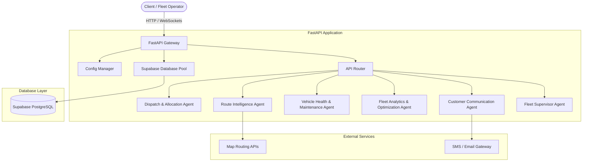

# AgentFleet

AgentFleet is an enterprise-grade, production-ready, Intelligent Fleet Management System powered by multi-agent AI cooperation. It is designed to optimize scheduling, routing, vehicle maintenance, and customer communication dynamically using independent, specialized AI agents.

This project is built for the **AGNIVERSE** college competition.

---

## 🚀 Project Overview

Modern logistics and fleet operations face complex, dynamic challenges including unpredictable traffic patterns, sudden vehicle breakdowns, changing customer demands, and multi-variable optimization. AgentFleet resolves these issues by deploying a crew of autonomous AI agents, each focusing on a distinct operational domain, coordinated to keep the fleet running at maximum efficiency.

---

## 🏛️ Architecture

AgentFleet uses a micro-agent orchestration pattern built on FastAPI, Supabase (PostgreSQL), and eventually CrewAI/LangGraph.



### The Six Orchestrated Agents

1. **Dispatch & Allocation Agent**: Automatically assigns vehicles and drivers to incoming requests based on distance, load capacity, and driver hours.
2. **Route Intelligence Agent**: Computes optimal routes, monitors real-time traffic/weather, and dynamically reroutes assets in transit.
3. **Vehicle Health & Maintenance Agent**: Monitages telemetry data, schedules preventative maintenance, and flags diagnostic trouble codes (DTCs).
4. **Fleet Analytics & Optimization Agent**: Analyzes historical trip data to uncover efficiency trends, fuel consumption rates, and idle time reductions.
5. **Customer Communication Agent**: Provides proactive ETA notifications, delay alerts, and handles customer queries during transit.
6. **Fleet Supervisor Agent**: Acts as the master orchestrator, resolving conflicts between agent decisions, enforcing business rules, and escalating critical issues to human operators.

---

## 🛠️ Technology Stack

| Layer | Technology | Description |
| :--- | :--- | :--- |
| **Backend** | Python 3.12, FastAPI | High-performance, asynchronous REST API gateway. |
| **Pydantic Validation** | Pydantic v2 | High-speed data serialization and request/response validation. |
| **ORM / Database Access**| SQLAlchemy | Modern SQL Toolkit and Object Relational Mapper. |
| **Database & Auth** | Supabase (PostgreSQL) | Fully-managed backend database, vector store, and user auth. |
| **AI Orchestration** | CrewAI & LangGraph | Frameworks for defining cooperative agent teams and stateful graphs. |
| **Frontend** | React, Vite, TailwindCSS | Modern, responsive single-page application dashboard. |
| **Deployment** | Docker | Containerized execution environment for backend and frontend. |

---

## 📂 Folder Structure

```directory
AgentFleet/
├── .github/                  # CI/CD workflows and GitHub templates
├── docker/                   # Dockerfiles and compose files for containerization
├── docs/                     # API documentation, design system, and user manuals
├── frontend/                 # React frontend application (Vite + TailwindCSS)
└── backend/                  # FastAPI backend application
    └── app/
        ├── api/              # Global API versioning and endpoint routing
        ├── core/             # Application configuration, security, and global settings
        ├── database/         # Supabase client configurations and database schemas
        ├── shared/           # Reusable helper functions, custom loggers, and constants
        ├── main.py           # Application entrypoint
        └── agents/           # Domain-specific AI Agents
            ├── dispatch/     # Dispatch & Allocation Agent package
            ├── route/        # Route Intelligence Agent package
            ├── maintenance/  # Vehicle Health & Maintenance Agent package
            ├── analytics/    # Fleet Analytics & Optimization Agent package
            ├── customer/     # Customer Communication Agent package
            └── supervisor/   # Fleet Supervisor Agent package
```

### Agent Package Blueprint

Each agent follows an identical structure to enforce standard practices and clean separation of concerns:
- `agent.py`: Agent definition, LangGraph state setups, or CrewAI Agent properties.
- `service.py`: Internal business logic, data formatting, and orchestration rules.
- `routes.py`: FastAPI endpoints exposed specifically by this agent.
- `schemas.py`: Input/Output Pydantic data schemas.
- `prompts.py`: Prompt templates, system instructions, and LLM guidelines.
- `tools.py`: Python tools and API helpers the agent can use to perform actions.

---

## 🗺️ Development Roadmap

- **Phase 1: Architecture Initialization** 🟢 (Current)
  - Create directory structures, requirements, config classes, and shared utility templates.
- **Phase 2: Database Schema & Supabase Setup** ⚪
  - Connect to Supabase, create database migrations, and configure SQLAlchemy models.
- **Phase 3: Core API Services** ⚪
  - Write CRUD endpoints for vehicles, routes, dispatches, and users.
- **Phase 4: Agent Logic Integration** ⚪
  - Develop each of the 6 agents sequentially using LangGraph and CrewAI.
- **Phase 5: Frontend Dashboard Implementation** ⚪
  - Build React dashboard showing live telemetry, alerts, and agent status.
- **Phase 6: Multi-Agent Testing & Optimization** ⚪
  - Run simulations, optimize token usage, and verify agent collaboration patterns.
