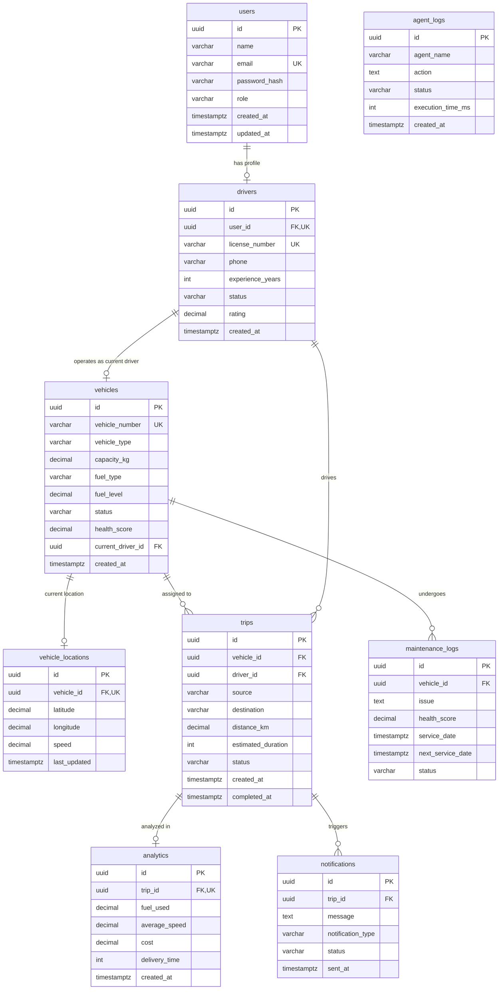

# AgentFleet Database Layer Design

This document details the database architecture designed for the **AgentFleet** intelligent fleet management system. It provides an enterprise-ready, fully normalized (3NF) relational layout configured for PostgreSQL on Supabase.

---

## 📊 Entity Relationship (ER) Diagram

---

## 🔗 Table Relationship Explanations

1. **`users` ↔ `drivers` (One-to-One / Optional)**:
   A driver must be a valid user in the system to authenticate and interact with APIs, but not all users (e.g., Admins, Fleet Managers) are drivers. Modeling this as a optional 1-to-1 table extension isolates driver-specific data (rating, license numbers, experience) from standard profile fields.
2. **`drivers` ↔ `vehicles` (One-to-One / Optional)**:
   A vehicle has at most one current driver (`vehicles.current_driver_id` pointing to `drivers.id`). This dynamic link represents active driver shifts. When a shift ends, this field is set to NULL, keeping vehicle states clean and normalized.
3. **`vehicles` ↔ `vehicle_locations` (One-to-One / Required)**:
   To ensure real-time tracking is performant, current location is separated from historical location tracking. Storing only the most recent latitude, longitude, and speed of an active vehicle keeps the query footprint minimal.
4. **`vehicles` & `drivers` ↔ `trips` (One-to-Many)**:
   A vehicle and a driver can perform multiple delivery dispatches over time. Both fields on `trips` are configured to `ON DELETE SET NULL` to preserve historical trip registries even if a driver or vehicle is removed from the active database.
5. **`trips` ↔ `analytics` (One-to-One / Required)**:
   Each trip produces at most one post-trip metric record. Placing calculations (average speed, exact fuel used, cost) in an isolated `analytics` table keeps transactional query speeds fast for ongoing trips.
6. **`trips` ↔ `notifications` (One-to-Many)**:
   A single delivery dispatch triggers multiple customer events (e.g., dispatcher alert on assignment, ETA adjustments by the Route Agent, arrival notifications by the Customer Agent).
7. **`vehicles` ↔ `maintenance_logs` (One-to-Many)**:
   Each vehicle accumulates a service and maintenance log history, preserving detailed records of diagnostics trouble codes (DTCs), sensor updates, and repairs.

---

## ⚡ Index Recommendations

To support real-time orchestration across the six AI agents, the following indexing strategy is implemented:

| Index Name | Target Table | Columns | Type / Rationale |
| :--- | :--- | :--- | :--- |
| **`idx_drivers_user_id`** | `drivers` | `user_id` | **B-tree**: Accelerates user login and profile resolution joins. |
| **`idx_vehicles_current_driver`** | `vehicles` | `current_driver_id` | **B-tree**: Speeds up queries fetching active vehicles for drivers. |
| **`idx_trips_vehicle_id`** | `trips` | `vehicle_id` | **B-tree**: Improves lookup of a vehicle's historic routes. |
| **`idx_trips_driver_id`** | `trips` | `driver_id` | **B-tree**: Optimizes performance of driver trip logs. |
| **`idx_maintenance_vehicle`** | `maintenance_logs` | `vehicle_id` | **B-tree**: Crucial for the Vehicle Health Agent checking repairs. |
| **`idx_notifications_trip`** | `notifications` | `trip_id` | **B-tree**: Optimizes delivery progress alerts retrieval. |
| **`idx_vehicles_status`** | `vehicles` | `status` | **B-tree**: Accelerates the Dispatch Agent's active fleet queries. |
| **`idx_drivers_status`** | `drivers` | `status` | **B-tree**: Optimizes queries searching for available operators. |
| **`idx_trips_status`** | `trips` | `status` | **B-tree**: Speeds up active trip updates and dashboards. |
| **`idx_agent_logs_name_time`** | `agent_logs` | `agent_name, created_at DESC` | **Composite**: Facilitates supervisor audit tracking by agent name sorted by latest timestamps. |

---

## 📈 Future Scalability Recommendations

As the AgentFleet system grows to manage hundreds of active vehicles, several PostgreSQL optimizations should be implemented:

### 1. Spatial Queries and PostGIS
* **Recommendation**: Enable the **PostGIS** extension in Supabase (`CREATE EXTENSION postgis;`).
* **Why**: Dynamic routing and location comparisons (e.g., finding the nearest driver using geographical boundaries) are computationally expensive with basic latitude/longitude mathematics. PostGIS introduces specialized geometry datatypes and spatial indexes (`GIST`) to execute sub-millisecond proximity queries.

### 2. Location History via TimescaleDB
* **Recommendation**: Transition `vehicle_locations` from a 1-to-1 table to a timeseries log table partition.
* **Why**: The Route Intelligence Agent will need breadcrumb paths to learn traffic behaviors. Enabling the TimescaleDB extension inside Supabase enables "Hypertables" to partition location entries automatically by time intervals (e.g. daily chunks), maintaining high write throughput while avoiding table bloat.

### 3. Log Table Partitioning
* **Recommendation**: Partition `agent_logs` and `notifications` using Declarative Table Partitioning by range (e.g., monthly chunks).
* **Why**: These tables represent logs that grow linearly. Without partitioning, query speeds for audit trails drop over time. Partitioning allows archiving or dropping old logs simply by dropping an old partition rather than executing expensive `DELETE` statements.

### 4. Supabase Row Level Security (RLS)
* **Recommendation**: Enforce RLS policies using Supabase JWT tokens.
* **Why**: Ensures strict boundaries (e.g., a Driver can only view or write to their own `drivers` and `vehicle_locations` records, whereas a Fleet Manager has full access to query `trips` and `analytics` across the fleet).

### 5. Analytics Read Replicas
* **Recommendation**: Separate write-heavy transactional operations from heavy analytical reports generated by the Fleet Analytics & Optimization Agent.
* **Why**: Aggregating fuel efficiency, costs, and trip distributions is resource-intensive. Directing analytical queries to read-only replicas prevents CPU starvation and transactional locks on the core tables.
